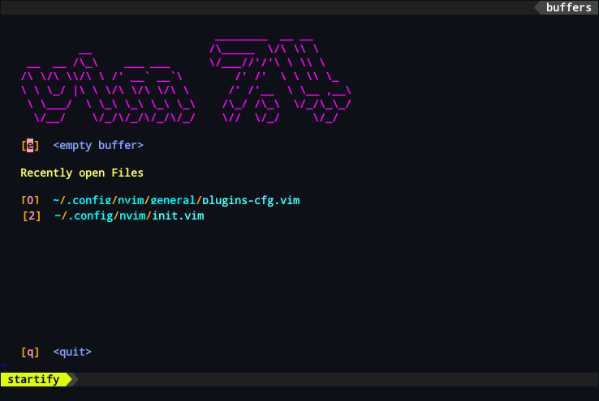

### Deserve Neovim</br></br>Requirements : Lua

-----------------------------

### Install Neovim

Ubuntu or Debian
```
sudo apt install neovim -y
```
Arch Linux
```
sudo pacman -S neovim
```

-----------------------------

### Project Management with the plugin Startify


-----------------------------
### After install Neovim, make directories and files.
### Or you can use my script (faster process) : 
```
$ mkdir ~/.config/nvim
$ touch ~/.config/nvim/init.vim
$ mkdir ~/.config/nvim/general
$ mkdir ~/.config/nvim/lua
$ touch ~/.config/nvim/general/plugins.vim
$ touch ~/.config/nvim/general/settings.vim
$ touch ~/.config/nvim/general/plugins-cfg.vim
$ touch ~/.config/nvim/general/functions.vim
$ touch ~/.config/nvim/general/simple-pairs.vim
$ touch ~/.config/nvim/general/maps.vim
$ touch ~/.config/nvim/lua/plug-colorizer.lua
```

-----------------------------

### General settings organization (init.vim)

```
source $HOME/.config/nvim/general/settings.vim
source $HOME/.config/nvim/general/maps.vim
source $HOME/.config/nvim/general/pairs.vim
source $HOME/.config/nvim/general/plugins.vim
source $HOME/.config/nvim/general/plugins-cfg.vim
source $HOME/.config/nvim/general/functions.vim
luafile $HOME/.config/nvim/lua/plug-colorizer.lua
```


-----------------------------

### Settings - (settings.vim)
```
syntax enable
set number
set numberwidth=4
set relativenumber
set termguicolors
set smartindent
set autoindent
set smarttab
set smartcase
set splitbelow
set splitright
set pumheight=9
set conceallevel=0
set updatetime=300
set timeoutlen=100
set ruler
set signcolumn=yes
set undofile
"set mousehide
set clipboard=unnamedplus
set mouse=a
set mousemodel=popup
set cursorline
set hidden
set writebackup
set nowrap
set noswapfile
set modeline
set softtabstop=2
set shiftwidth=2
set showtabline=2
set encoding=UTF-8
set fileencoding=UTF-8
set autowriteall
set emoji
set icon
set ignorecase
set expandtab "<CTRL>+V<TAB>
```

-----------------------------
  
### Plugins - (plugins.vim) 
```
Plugin 'junegunn/fzf', { 'do': { -> fzf#install() } }
Plugin 'junegunn/fzf.vim'
Plugin 'vim-airline/vim-airline'
Plugin 'vim-airline/vim-airline-themes'
Plugin 'ryanoasis/vim-devicons'
Plugin 'preservim/nerdtree'
Plugin 'mhinz/vim-startify'
Plugin 'neoclide/coc.nvim', {'branch': 'release'}
Plugin 'norcalli/nvim-colorizer.lua'
```

-----------------------------

### Additional settings of plugins - (plugins-cfg.vim)
```
" Vim-Airline 
let g:airline#extensions#tabline#enabled = 1
let g:airline#extensions#tabline#left_sep = ' '
let g:airline#extensions#tabline#left_alt_sep = '|'
let g:airline#extensions#tabline#formatter = 'jsformatter'
let g:airline_powerline_fonts = 1

" FZF
let g:fzf_preview_window = ['right:50%', 'ctrl-/']
let g:fzf_buffers_jump = 1

" NERDTree
let g:NERDTreeDirArrowExpandable = ''
let g:NERDTreeDirArrowCollapsible = ''

" Startify
let g:startify_session_dir = '~/.config/nvim/sessions'
let g:startify_lists = [
      "\ { 'type': 'dir',       'header': [' Currently open Directories '. getcwd()] },
      \ { 'type': 'files',     'header': ['   Recently open Files '] },
      \ { 'type': 'sessions',  'header': ['   Sessions']       },
      "\ { 'type': 'bookmarks', 'header': ['   Bookmarks']      },
      \ ]
let g:startify_bookmarks = [ 
      \ { 'n': '~/.config/nvim/init.vim' },
      \ { 'l': '~/Learn'},
      \ ]
let g:startify_custom_header = [
      \ '                                 ________  __ __        ',
      \ '            __                  /\_____  \/\ \\ \       ',
      \ '    __  __ /\_\    ___ ___      \/___//''/''\ \ \\ \    ',
      \ '   /\ \/\ \\/\ \ /'' __` __`\        /'' /''  \ \ \\ \_ ',
      \ '   \ \ \_/ |\ \ \/\ \/\ \/\ \      /'' /''__  \ \__ ,__\',
      \ '    \ \___/  \ \_\ \_\ \_\ \_\    /\_/ /\_\  \/_/\_\_/  ',
      \ '     \/__/    \/_/\/_/\/_/\/_/    \//  \/_/     \/_/    ',
      \ ]

```
<b><code>let g:startify_session_dir = '~/.config/nvim/sessions'</code> Essential line to save sessions</b>


-----------------------------
  
### Functions created to open a new file with the syntax : Go, Python and CLang - (functions.vim)
```
function! Python()
  call append(0, '#!/bin/python3')
  call append(1, '#-*-coding:utf-8-*-')
endfunction
autocmd BufNewFile *.py call Python()

function! C()
  call append(0, '#include <stdio.h>')
  call append(1, 'int main(void){}')
endfunction
autocmd BufNewFile *.c call C()

function! Go()
  call append(0, 'package main')
  call append(1, 'import "fmt"')
  call append(2, 'func main(){}')
endfunction
autocmd BufNewFile *.go call Go()
```

-----------------------------
  
### Mappings to run Python, Go and Lua - (maps.vim)
```
" Run Python3
nnoremap <C-P> :!python3 "%" <CR>
inoremap <C-P> :!python3 "%" <CR>

" Run Lua
nnoremap <C-D> :!lua "%" <CR>
inoremap <C-D> :!lua "%" <CR>

" Run Go
nnoremap <C-G> :!go run "%"<CR>
inoremap <C-G> :!go run "%"<CR>
```

-----------------------------
  
### Interactive auto pairs - (pairs.vim)
```
inoremap " ""<left>
inoremap ' ''<left>
inoremap [ []<left>
inoremap ( ()<left>
inoremap { {}<left>
```

-----------------------------
  
### Mappings
```
" Select all the file
map <C-A> ggVG <CR>

" Save
nnoremap <C-S> :w <CR>
inoremap <C-S><Esc> :w <CR>i<right>

" Save and quit
nnoremap <C-X> :x <CR>
inoremap <C-X><Esc> :x <CR>

" Quit
nnoremap <C-Q> :q <CR>

" Next Buffer and Previous Buffer
nnoremap <TAB> :bnext <CR>
nnoremap <S-TAB> :bprevious <CR>

" Navigation
nnoremap <C-E> <C-W>h
nnoremap <C-R> <C-W>l
nnoremap <C-U> <C-W>k
nnoremap <C-I> <C-W>j

" FZF Maps
map <C-F> :Files <CR>
noremap <C-L> :BLines <CR>
inoremap <C-L><Esc> :BLines <CR> 

" NERDTree Maps
nnoremap <C-N> :NERDTreeToggle<CR>
nnoremap <C-B> :NERDTreeFind<CR>

" Startfy Save Sessions
nnoremap <C-Y> :SSave<CR>
```
  
### Colorizer (plug-colorizer.lua)
```
require'colorizer'.setup()
DEFAULT_OPTIONS = {
	RGB      = true;         -- #RGB hex codes
	RRGGBB   = true;         -- #RRGGBB hex codes
	names    = true;         -- "Name" codes like Blue
	RRGGBBAA = true;        -- #RRGGBBAA hex codes
	rgb_fn   = true;        -- CSS rgb() and rgba() functions
	hsl_fn   = true;        -- CSS hsl() and hsla() functions
	css      = true;        -- Enable all CSS features: rgb_fn, hsl_fn, names, RGB, RRGGBB
	css_fn   = true;        -- Enable all CSS *functions*: rgb_fn, hsl_fn
	-- Available modes: foreground, background
        mode     = 'background'; -- Set the display mode.
  }

```
  
#### Then :
``` 
<ESC> :CocInstall coc-lua
<ESC> :source $MYVIMRC
```
-----------------------------
  
### ToDo List
- [ ] Test and Re-test
- [ ] Installation Windows
- [ ] .vim to .lua 
